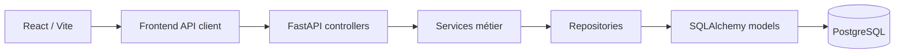

# Skill Management API

Application web de gestion des compétences et de la formation des Employees. Elle associe une API REST FastAPI, une interface React/Vite et une base PostgreSQL.

## Fonctionnalités principales

- administration des Employees, rôles et profils de permissions ;
- hiérarchie directe via `Employee.id_manager` ;
- référentiels Skills, Domaines, Trainings, Diplomas et Certifications ;
- acquisitions Training, Diploma, Certification et `DECLARED` ;
- demandes de formation et traitement Manager/HR ;
- Participations et acquisitions après completion ;
- évaluations terrain `SkillValidation`, batch et historique ;
- profil de compétences et recherche par niveaux acquis/évalués ;
- Dashboard adapté au profil de permissions.

## Stack technique

- Python, FastAPI, SQLAlchemy, PostgreSQL et `psycopg` ;
- Alembic pour les migrations ;
- Redis pour le cache et les sessions ;
- Uvicorn pour servir l’API ;
- React 18, React Router et Vite ;
- pytest et ESLint.

Les versions explicitement fixées sont dans `requirements.txt` et `frontend/package.json`.

## Architecture



- `controllers/` : routes HTTP et adaptation des erreurs ;
- `services/` : règles métier et orchestration ;
- `db/repositories/` : requêtes et persistance SQLAlchemy ;
- `models/` : modèles ORM ;
- `dto/` : contrats d’entrée et de sortie ;
- `migrations/` : versions Alembic ;
- `frontend/src/` : application React ;
- `tests/` : tests repository, service, API, lifecycle et autorisation.

## Règles métier importantes

### Acquisition et évaluation

Le profil distingue deux dimensions indépendantes :

- `acquired_level` : meilleur niveau issu des acquisitions formelles actives ;
- `evaluated_level` : niveau issu de la `SkillValidation` courante.

Les acquisitions peuvent provenir de Training, Diploma, Certification ou `DECLARED`. Une SkillValidation est une observation interne/terrain ; elle ne crée jamais une acquisition formelle.

Les états suivants sont valides :

```text
acquired_level = 4, evaluated_level = null
acquired_level = null, evaluated_level = 4
acquired_level = 4, evaluated_level = 3
```

### Acquisition DECLARED

`DECLARED` est une acquisition saisie par HR, par exemple depuis un CV, un entretien, un recrutement ou une correction ultérieure du profil. Elle alimente `acquired_level` et `acquired_sources`, sans créer de SkillValidation ni `evaluated_level`.

### Hiérarchie

`Employee.id_manager` représente uniquement le responsable hiérarchique direct. Un Employee possède zéro ou un manager direct, et `id_manager = NULL` est valide, y compris pour un MANAGER ou un HR.

La hiérarchie est indépendante de `PermissionProfile`. Il n’existe pas d’affectation automatique des Managers sous HR ni d’entité `Team` persistée.

Les règles backend imposent notamment :

- seuls les profils MANAGER ou HR peuvent être managers ;
- auto-management interdit ;
- manager inexistant ou archivé interdit ;
- cycles directs et indirects interdits ;
- archivage ou rétrogradation d’un manager avec des directs reports actifs interdits.

### Scope d’évaluation Manager

Un Manager peut évaluer uniquement ses collaborateurs directs :

```text
target.id_manager == manager.id_employee
```

Les collaborateurs indirects sont hors scope, quelle que soit la profondeur de la chaîne. HR conserve son scope global défini par le backend.

## Profils utilisateur

### EMPLOYEE

Consulte son profil de compétences, les formations disponibles, ses demandes et ses Participations. Il ne peut pas administrer les Employees, la hiérarchie ou créer des évaluations.

### MANAGER

Dispose des fonctions Employee et peut consulter `Mon équipe`, consulter les acquis de ses directs reports, les évaluer dans son scope, traiter les demandes de formation de son scope et rechercher des Employees selon les règles existantes. Il ne dispose pas des fonctions d’administration HR.

### HR

Dispose du scope administratif global prévu par l’application : Employee Admin, Équipes & Managers, référentiels, Trainings, acquisitions, demandes, Participations, évaluations et recherche.

Le backend reste l’autorité pour toutes les permissions.

## Workflows principaux

### Formation

```text
Training
  → TrainingSkill ou support Diploma/Certification
  → TrainingRequest
  → approbation ou refus
  → Participation REGISTERED
  → IN_PROGRESS à la date de début
  → clôture explicite
  → acquisition éventuelle
  → Employee Skill Profile
```

La fin calendaire d’une Training ne clôture pas automatiquement une Participation ; la clôture reste explicite.

### Évaluation terrain

```text
Manager
  → Mon équipe
  → Employee
  → Évaluer
  → sélection volontaire de Skills
  → SkillValidation
  → profil Employee
```

Une évaluation peut être partielle et introduire une Skill terrain-only. Les validations précédentes sont conservées selon le mécanisme de supersession.

### Acquisition déclarée

```text
HR
  → Employee
  → Acquis
  → Compétences déclarées
  → Skill + niveau
  → Employee Skill Profile
```

Cette opération alimente uniquement la dimension d’acquisition.

### Hiérarchie

```text
HR
  → Équipes & Managers
  → affecter, réaffecter ou retirer un manager
  → Employee.id_manager
```

L’écran administre une relation Employee existante ; il ne crée pas d’entité Team.

## Structure du repository

```text
skill_management_api/
├── controllers/
├── core/
├── db/repositories/
├── dto/
├── migrations/
├── models/
├── services/
├── tests/
├── frontend/
├── alembic.ini
├── compose.yml
└── main.py
```

## Installation

Prérequis : Python, Node.js/npm, PostgreSQL, Redis et Docker si les services locaux de `compose.yml` sont utilisés.

```bash
python -m venv .venv
source .venv/bin/activate
pip install -r requirements.txt

cd frontend
npm install
cd ..
```

`compose.yml` fournit PostgreSQL sur `localhost:5433` et Redis sur `localhost:6379` :

```bash
docker compose up -d
```

## Configuration

Le backend charge `.env` avec `python-dotenv`. Ce fichier local est ignoré par Git et ses valeurs ne doivent pas être publiées.

| Variable | Rôle | Défaut/obligation |
|---|---|---|
| `DATABASE_URL` | URL SQLAlchemy/PostgreSQL pour l’application et Alembic | obligatoire |
| `LOCAL_REDIS_URL` | Redis utilisé pour cache et sessions | `redis://127.0.0.1:6379/0` |
| `CORS_ORIGINS` | origines autorisées par le backend | localhost frontend |
| `AUTH_SESSION_TTL_SECONDS` | durée de session en secondes | `3600` |
| `AUTH_COOKIE_SECURE` | attribut Secure du cookie | `false` |
| `AUTH_COOKIE_SAMESITE` | attribut SameSite du cookie | `lax` |
| `VITE_API_URL` | URL du backend utilisée par React | `http://localhost:8001` |

Le code consomme `LOCAL_REDIS_URL`. Une configuration locale peut contenir un nom différent, comme `REDIS_URL`, mais ce nom n’est pas utilisé par le runtime actuel.

## Base de données et migrations

Alembic est configuré par `alembic.ini` et `migrations/env.py`. Il lit `DATABASE_URL` depuis l’environnement.

```bash
alembic upgrade head
```

Le script `reset_db.sh` recrée la base du conteneur local, applique les migrations et charge `db/sql/seed.sql`. Il est destructif et ne doit pas être utilisé sur une base à conserver.

## Lancement

Depuis la racine :

```bash
source .venv/bin/activate
uvicorn main:app --reload --port 8001
```

Le lancement direct de `main.py` utilise également le port `8001`.

Dans un second terminal :

```bash
cd frontend
npm run dev
```

Vite utilise son port local par défaut, normalement `5173`, sauf configuration locale différente.

## Tests et qualité

```bash
PYTHONPATH=. ./.venv/bin/pytest -q tests
PYTHONPATH=. ./.venv/bin/python -m compileall -q .

cd frontend
npm run build
npm run lint
```

La suite backend couvre notamment les repositories, services, API, autorisations, lifecycles et règles métier. Il n’existe pas encore de suite automatisée de tests d’interaction React ; le frontend est validé par build et lint.

## API et OpenAPI

La documentation FastAPI est disponible lorsque le backend est lancé :

- Swagger UI : `http://localhost:8001/docs` ;
- ReDoc : `http://localhost:8001/redoc` ;
- schéma OpenAPI : `http://localhost:8001/openapi.json`.

Les principaux préfixes sont `/auth`, `/employee`, `/skill`, `/domaine`, `/training`, `/training-requests`, `/participations`, `/skill_validation`, `/employee_diploma`, `/employee_certification`, `/employee_declared_skill` et `/dashboard`.

## Scénario de démonstration

En l’absence d’un dataset de démonstration portable, les données doivent être préparées dans l’environnement local.

1. HR configure un Employee, un Manager et une Training avec ses Skills.
2. L’Employee consulte les Trainings disponibles et crée une demande.
3. Le Manager autorisé ou HR traite la demande.
4. L’approbation crée une Participation.
5. La Participation démarre puis est clôturée explicitement.
6. L’acquisition apparaît dans le profil Skill.
7. Le Manager direct ou HR ouvre l’évaluation de l’Employee et sélectionne volontairement une ou plusieurs Skills.
8. Le profil affiche séparément les niveaux acquis et évalués.
9. La recherche exploite les dimensions acquise et évaluée.

## État actuel et limites

- le MVP métier est couvert de bout en bout par le backend et le frontend ;
- les tests d’interaction React ne sont pas automatisés ;
- certaines pages React restent denses et pourraient être découpées ;
- des types historiques de validation peuvent être conservés pour l’historique, même s’ils ne sont plus proposés comme choix d’évaluation terrain.

