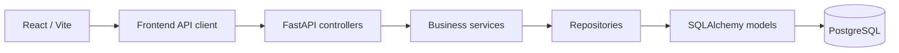

# Skill Management API

A web application for managing Employee skills and training. It combines a FastAPI REST API, a React/Vite frontend, and PostgreSQL.

## Main features

- Employee, role, and permission-profile administration;
- direct hierarchy through `Employee.id_manager`;
- Skill, Domaine, Training, Diploma, and Certification reference data;
- acquisitions from Training, Diploma, Certification, and `DECLARED`;
- training requests, Participations, and completion-based acquisitions;
- field evaluations through `SkillValidation`, including batch entry and history;
- Employee skill profiles, skill search, and a permission-profile-specific Dashboard.

## Technology stack

- Python, FastAPI, SQLAlchemy, PostgreSQL, and `psycopg`;
- Alembic migrations;
- Redis for cache and authentication sessions;
- Uvicorn;
- React 18, React Router, Vite, pytest, and ESLint.

Pinned versions are listed in `requirements.txt` and `frontend/package.json`.

## Architecture



- `controllers/`: HTTP routes and error adaptation;
- `services/`: business rules and orchestration;
- `db/repositories/`: SQLAlchemy queries and persistence;
- `models/`: ORM models;
- `dto/`: input/output contracts;
- `migrations/`: Alembic revisions;
- `frontend/src/`: React application;
- `tests/`: repository, service, API, lifecycle, and authorization tests.

## Important business rules

### Acquisition and evaluation

The Employee skill profile keeps two independent dimensions:

- `acquired_level`: the highest level provided by the Employee’s active acquisition sources;
- `evaluated_level`: the level provided by the current `SkillValidation`.

Acquisition sources are Training, Diploma, Certification, and `DECLARED`. A `SkillValidation` is an internal/field evaluation and never creates a formal acquisition.

Valid states include:

```text
acquired_level = 4, evaluated_level = null
acquired_level = null, evaluated_level = 4
acquired_level = 4, evaluated_level = 3
```

### DECLARED acquisition

`DECLARED` is an acquisition entered by HR from a CV, interview, recruitment information, or a later profile correction. It contributes to `acquired_level` and `acquired_sources`, but does not create a `SkillValidation` or an `evaluated_level`.

### Hierarchy

`Employee.id_manager` represents only the direct hierarchical manager. An Employee can have zero or one direct manager, and `id_manager = NULL` is valid, including for MANAGER and HR.

Hierarchy is independent from `PermissionProfile`. Managers are not automatically placed under HR, and no persistent `Team` entity is the source of truth.

Backend rules include:

- only MANAGER or HR profiles can manage direct reports;
- self-management is forbidden;
- missing or archived managers are forbidden;
- direct and indirect cycles are forbidden;
- archiving or demoting a manager with active direct reports is forbidden.

### Manager evaluation scope

A Manager can evaluate direct reports only:

```text
target.id_manager == manager.id_employee
```

Indirect reports are outside the scope at any depth. HR keeps the global scope defined by the backend.

## User profiles

### EMPLOYEE

An Employee can consult their skill profile, available Trainings, own requests, and Participations. They cannot administer Employees or hierarchy, or create evaluations.

### MANAGER

A Manager can access `My Team`, view acquisitions for direct reports, evaluate direct reports, process in-scope training requests, and search Employees under the existing rules. HR administration functions are not available to them.

### HR

HR has the global administrative capabilities provided by the application: Employee administration, Teams & Managers, reference data, Trainings, acquisitions, requests, Participations, evaluations, and search.

The backend remains the authority for all permissions.

## Main workflows

### Training

Training configuration and execution are separate concerns:

```text
Training configuration
  ├── TrainingSkill relations
  └── optional Diploma / Certification support
          ↓
TrainingRequest
          ↓
approval or refusal
          ↓
Participation REGISTERED
          ↓
IN_PROGRESS at the training start date
          ↓
explicit closure
          ↓
possible acquisition
          ↓
Employee Skill Profile
```

The calendar end of a Training does not automatically close a Participation; closure remains explicit.

### Field evaluation

```text
Manager
  → My Team
  → Employee
  → evaluate
  → voluntarily selected Skills
  → SkillValidation
  → Employee profile
```

An evaluation can be partial and can introduce a field-only Skill. Previous validations are retained through supersession.

### Declared acquisition

```text
HR
  → Employee
  → Acquisitions
  → Declared skills
  → Skill + level
  → Employee Skill Profile
```

This operation only affects the acquisition dimension.

### Hierarchy administration

```text
HR
  → Teams & Managers
  → assign, reassign, or remove a manager
  → Employee.id_manager
```

This screen administers an Employee relationship; it does not create a Team entity.

## Repository structure

```text
skill_management_api/
├── controllers/
├── core/
├── db/repositories/
├── dto/
├── migrations/
├── models/
├── services/
├── tests/
├── frontend/
├── alembic.ini
├── compose.yml
└── main.py
```

## Installation

Prerequisites: Python, Node.js/npm, PostgreSQL, Redis, and Docker if the local services from `compose.yml` are used.

```bash
python -m venv .venv
source .venv/bin/activate
pip install -r requirements.txt

cd frontend
npm install
cd ..
```

`compose.yml` provides PostgreSQL on `localhost:5433` and Redis on `localhost:6379`:

```bash
docker compose up -d
```

## Configuration

The backend loads `.env` with `python-dotenv`. This local file is ignored by Git and its values must not be published.

| Variable | Purpose | Default/requirement |
|---|---|---|
| `DATABASE_URL` | SQLAlchemy/PostgreSQL URL for the application and Alembic | required |
| `LOCAL_REDIS_URL` | Redis URL used for cache and sessions | `redis://127.0.0.1:6379/0` |
| `CORS_ORIGINS` | backend-allowed origins | local frontend origins |
| `AUTH_SESSION_TTL_SECONDS` | session lifetime in seconds | `3600` |
| `AUTH_COOKIE_SECURE` | cookie Secure attribute | `false` |
| `AUTH_COOKIE_SAMESITE` | cookie SameSite attribute | `lax` |
| `VITE_API_URL` | backend URL used by the React API client | `http://localhost:8001` |

## Database and migrations

Alembic is configured through `alembic.ini` and `migrations/env.py`. It reads `DATABASE_URL` from the environment.

```bash
alembic upgrade head
```

The destructive `reset_db.sh` script recreates the local PostgreSQL container database, applies migrations, and loads `db/sql/seed.sql`. Do not use it on a database that must be preserved.

The seed initializes reference data, Employees, roles, Trainings, acquisition references, Participations, TrainingRequests, and SkillValidations. It supports local exploration but does not provide a complete scripted walkthrough of every current workflow, including later `DECLARED` acquisition entry.

## Running the project

```bash
source .venv/bin/activate
uvicorn main:app --reload --port 8001
```

Running `main.py` directly also uses port `8001`.

In a second terminal:

```bash
cd frontend
npm run dev
```

Vite uses its default development port, normally `5173`, unless locally configured otherwise.

## Tests and quality checks

```bash
PYTHONPATH=. ./.venv/bin/pytest -q tests
PYTHONPATH=. ./.venv/bin/python -m compileall -q .

cd frontend
npm run build
npm run lint
```

The backend suite covers repositories, services, APIs, authorization, lifecycles, and business rules. There is no automated React interaction/component test suite yet; the frontend is validated through build and lint.

## API and OpenAPI

When the backend is running:

- Swagger UI: `http://localhost:8001/docs`;
- ReDoc: `http://localhost:8001/redoc`;
- OpenAPI schema: `http://localhost:8001/openapi.json`.

Main API prefixes include `/auth`, `/employee`, `/skill`, `/domaine`, `/training`, `/training-requests`, `/participations`, `/skill_validation`, `/employee_diploma`, `/employee_certification`, `/employee_declared_skill`, and `/dashboard`.

## Demo scenario

The repository includes a substantial SQL seed with Employees, roles, reference data, Trainings, TrainingRequests, Participations, and SkillValidations. It must be loaded through the reset script and is intended for local exploration; no separate demo-account documentation is provided.

1. Start local PostgreSQL and Redis.
2. Apply or reset the database and load the seed.
3. Log in with a seeded Employee using the development password defined in the seed file.
4. As HR, inspect Employee administration, hierarchy, Trainings, and reference data.
5. As an Employee, inspect available Trainings and create a request.
6. As the relevant Manager or HR user, process the request.
7. Inspect the resulting Participation and Skill profile.
8. As a direct Manager or HR, evaluate selected Skills and compare acquired and evaluated levels.
9. Use Employee skill search for the separate acquired and evaluated dimensions.

The seed contains development credentials and must only be used locally.

## Current state and limitations

- the MVP business workflows are covered end to end by the backend and frontend;
- React interaction tests are not automated yet;
- some React pages remain dense and could be split later;
- historical validation types may remain for history, even though they are no longer offered as arbitrary field-evaluation choices.
